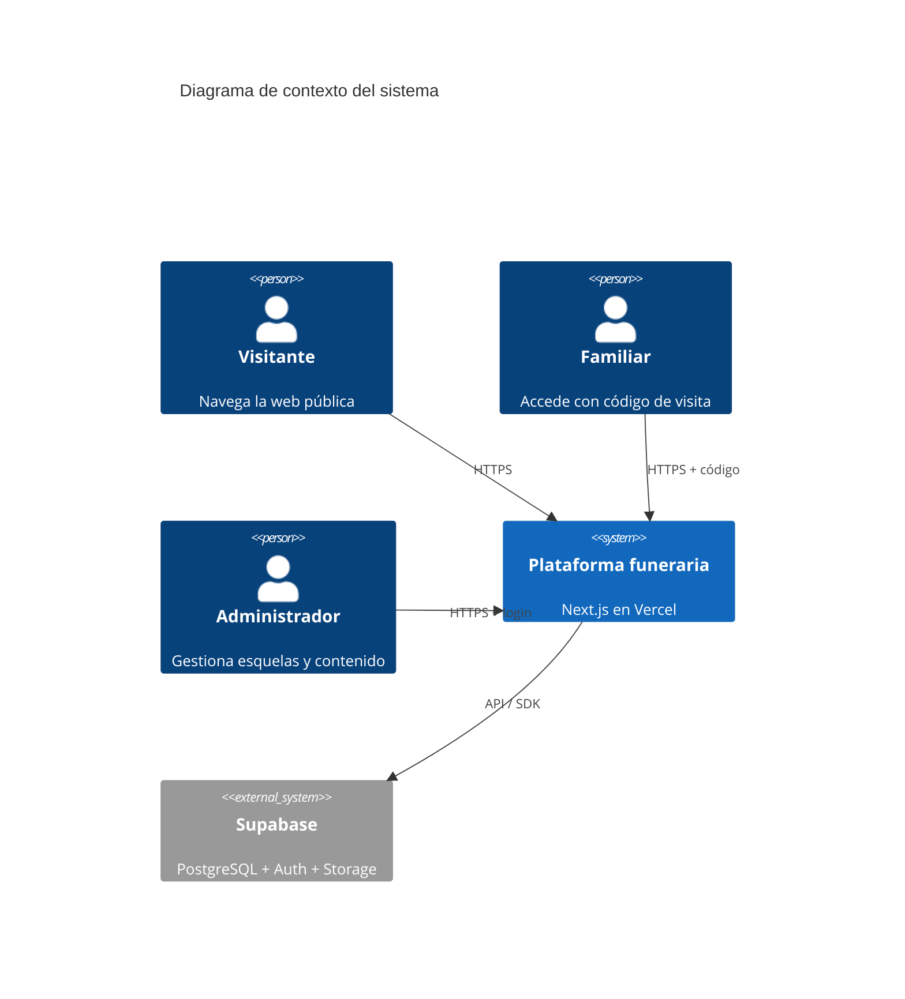
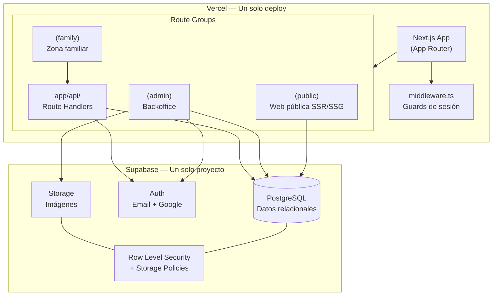
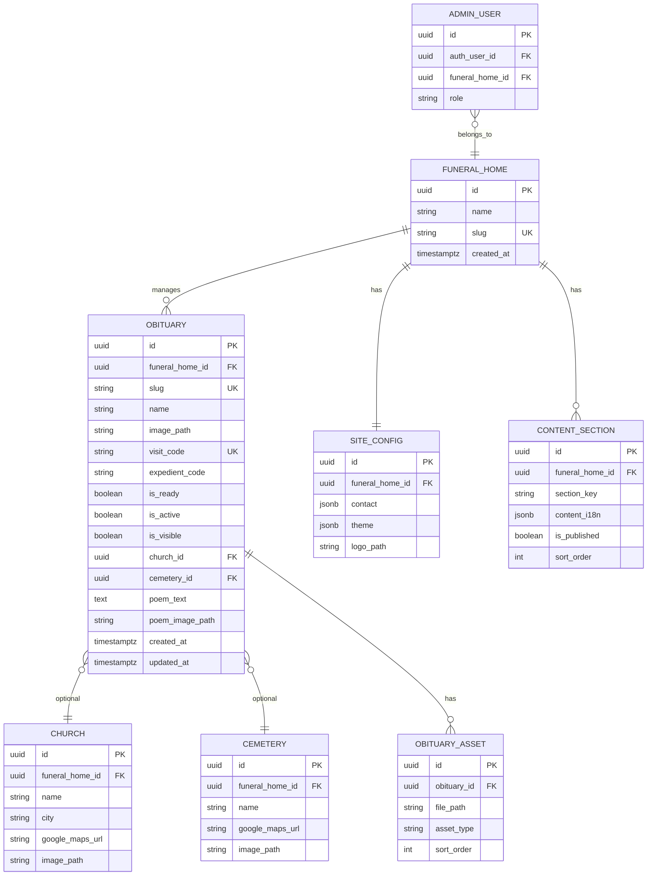
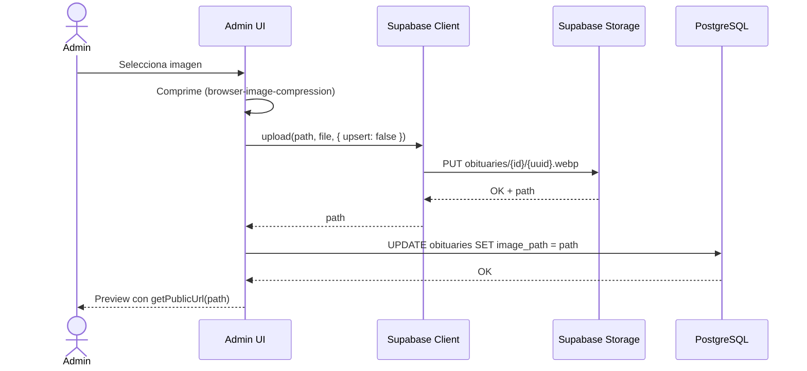
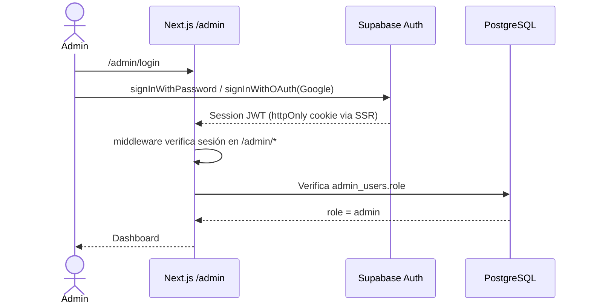
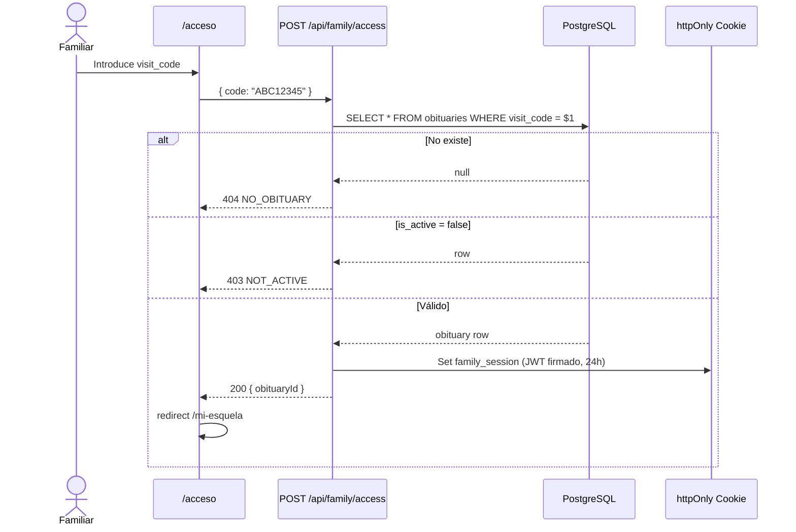
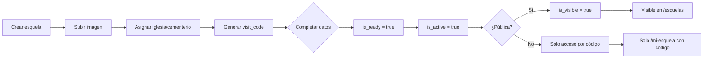
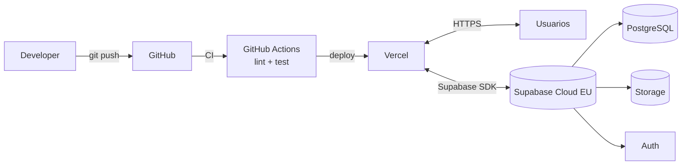

# Documento de Arquitectura de Software (DAS)

## Plataforma web funeraria — Eurega Solutions

**Versión:** 1.0  
**Fecha:** 4 de julio de 2026  
**Documentos relacionados:** [ROADMAP_ENTREGA.md](./ROADMAP_ENTREGA.md) · [DOCUMENTO_REQUISITOS.md](./DOCUMENTO_REQUISITOS.md) · [ESTRATEGIA_DESARROLLO_LOCAL.md](./ESTRATEGIA_DESARROLLO_LOCAL.md)  
**Estado:** Aprobado para inicio de desarrollo greenfield

---

## 1. Resumen ejecutivo

Este documento define la arquitectura técnica para reimplementar la plataforma funeraria desde cero. La solución adoptada es un **monolito modular frontend** desplegado como una única aplicación **Next.js**, con backend gestionado íntegramente en **Supabase** (PostgreSQL, Auth y Storage).

### Decisiones arquitectónicas clave

| Decisión | Elección | Motivo |
|----------|----------|--------|
| Frontend | Next.js 15 + TypeScript | SSR/SSG para SEO de esquelas, App Router, API Routes integradas |
| UI | Tailwind CSS + shadcn/ui | Desarrollo rápido, accesible, coherente entre web pública y admin |
| Backend | Supabase (único proveedor) | BDD relacional, auth admin, imágenes en Storage — sin AWS S3 ni API externa |
| Estructura | **Un solo repositorio** | Web pública, zona familiar y backoffice como route groups del mismo proyecto |
| Despliegue | Vercel | Optimizado para Next.js, preview por PR, CDN global |
| i18n | next-intl | ES, CA, EN con detección de idioma y rutas localizadas |
| Estado cliente | TanStack Query | Caché, revalidación y sincronización con Supabase |

### Lo que explícitamente NO se hace

- ❌ Proyecto separado para el backoffice
- ❌ Almacenamiento de imágenes en S3, R2 u otro proveedor externo
- ❌ API REST en AWS API Gateway (legacy)
- ❌ Firebase / Angular 9 / Pug (legacy)
- ❌ Hash routing (`/#/page/home`)
- ❌ Librería privada `@eurega/web-core`

---

## 2. Vista de contexto (C4 — Nivel 1)



**Alcance del sistema:** una aplicación web full-stack que cubre presencia corporativa, publicación de esquelas, acceso privado familiar y panel de administración.

**Dependencia externa única:** Supabase Cloud (región EU recomendada: `eu-west-1` o Frankfurt).

---

## 3. Vista de contenedores (C4 — Nivel 2)



| Contenedor | Responsabilidad |
|------------|-----------------|
| **Next.js (public)** | Landing, listado/detalle esquelas públicas, SEO |
| **Next.js (family)** | Login por código, vista privada de esquela |
| **Next.js (admin)** | CRUD esquelas, lugares, contenido web, uploads |
| **Next.js (api)** | Validación código familiar, operaciones server-only |
| **Supabase PostgreSQL** | Fuente de verdad de todos los datos |
| **Supabase Auth** | Sesiones de administradores |
| **Supabase Storage** | Binarios de imágenes (esquelas, CMS, lugares) |

---

## 4. Stack tecnológico detallado

### 4.1 Frontend y runtime

| Tecnología | Versión | Uso |
|------------|---------|-----|
| Next.js | 15.x | Framework full-stack, App Router |
| React | 19.x | UI |
| TypeScript | 5.x | Tipado estático en todo el proyecto |
| Tailwind CSS | 4.x | Estilos utility-first |
| shadcn/ui | latest | Componentes accesibles (Button, Dialog, Table, Form…) |
| next-intl | 3.x | Internacionalización |
| TanStack Query | 5.x | Server state en cliente |
| React Hook Form | 7.x | Formularios admin y acceso familiar |
| Zod | 3.x | Validación schemas (formularios + API) |
| Lucide React | latest | Iconos |
| browser-image-compression | latest | Compresión pre-upload en cliente |

### 4.2 Backend (Supabase)

| Servicio Supabase | Uso en el proyecto |
|-------------------|-------------------|
| **PostgreSQL** | Esquelas, iglesias, cementerios, secciones CMS, configuración |
| **Auth** | Login admin: email/contraseña + OAuth Google |
| **Storage** | Todas las imágenes del sistema |
| **RLS** | Permisos a nivel fila en tablas |
| **Storage Policies** | Permisos lectura/escritura en buckets |
| **Database Functions** | Lógica sensible (generar `visit_code`, triggers) |
| **Edge Functions** | *(Opcional v1.1)* Webhooks, tareas async |

### 4.3 Herramientas de desarrollo

| Herramienta | Uso |
|-------------|-----|
| Supabase CLI | Migraciones locales, tipos TypeScript generados |
| Prisma o Drizzle | ORM / migraciones *(elegir uno; Drizzle recomendado por ligereza con Supabase)* |
| ESLint + Prettier | Calidad de código |
| Vitest | Tests unitarios |
| Playwright | Tests e2e (flujos críticos) |
| GitHub Actions | CI: lint, test, preview deploy |

### 4.4 Despliegue

| Entorno | Plataforma | Rama |
|---------|------------|------|
| Producción | Vercel + Supabase prod | `main` |
| Staging | Vercel Preview + Supabase staging | `develop` |
| Local | `next dev` + Supabase local (`supabase start`) | feature branches |

---

## 5. Estructura del repositorio

Un **único repositorio Git**. No existen sub-proyectos, workspaces ni apps separadas para el admin.

```
funeraria/
├── .github/
│   └── workflows/
│       ├── ci.yml
│       └── deploy-preview.yml
├── docs/
│   ├── DOCUMENTO_REQUISITOS.md
│   └── arquitectura.md
├── supabase/
│   ├── config.toml
│   ├── migrations/           # SQL versionado
│   │   ├── 001_initial_schema.sql
│   │   ├── 002_rls_policies.sql
│   │   └── 003_storage_policies.sql
│   └── seed.sql              # Datos de desarrollo
├── public/
│   ├── favicon.ico
│   └── fonts/
├── src/
│   ├── app/
│   │   ├── [locale]/                    # Prefijo i18n (opcional)
│   │   │   ├── (public)/
│   │   │   │   ├── layout.tsx
│   │   │   │   ├── page.tsx             # Home
│   │   │   │   ├── esquelas/
│   │   │   │   │   ├── page.tsx         # Listado
│   │   │   │   │   └── [slug]/page.tsx  # Detalle SSR
│   │   │   │   └── servicios/page.tsx
│   │   │   ├── (family)/
│   │   │   │   ├── layout.tsx
│   │   │   │   ├── acceso/page.tsx      # Formulario código
│   │   │   │   └── mi-esquela/page.tsx  # Vista privada
│   │   │   ├── (admin)/
│   │   │   │   ├── layout.tsx           # Sidebar + auth guard
│   │   │   │   ├── page.tsx             # Dashboard
│   │   │   │   ├── login/page.tsx
│   │   │   │   ├── esquelas/
│   │   │   │   │   ├── page.tsx         # Datatable
│   │   │   │   │   ├── nueva/page.tsx
│   │   │   │   │   └── [id]/page.tsx    # Edición
│   │   │   │   ├── lugares/
│   │   │   │   │   ├── iglesias/
│   │   │   │   │   └── cementerios/
│   │   │   │   ├── contenido/
│   │   │   │   │   └── page.tsx         # Editor secciones home
│   │   │   │   └── configuracion/
│   │   │   │       └── page.tsx         # Contacto, tema, logo
│   │   │   └── layout.tsx               # Root locale layout
│   │   └── api/
│   │       ├── family/
│   │       │   ├── access/route.ts      # POST — validar código
│   │       │   └── logout/route.ts
│   │       ├── auth/
│   │       │   └── callback/route.ts    # OAuth Supabase
│   │       └── revalidate/route.ts      # On-demand ISR (opcional)
│   ├── components/
│   │   ├── public/                      # Hero, Pricing, Portfolio…
│   │   ├── family/
│   │   ├── admin/                       # DataTable, ImageUpload, Sidebar
│   │   └── ui/                          # shadcn primitives
│   ├── lib/
│   │   ├── supabase/
│   │   │   ├── client.ts                # Browser client
│   │   │   ├── server.ts                # Server Components / Actions
│   │   │   ├── middleware.ts            # Session refresh
│   │   │   └── admin.ts                 # Service role (solo server)
│   │   ├── auth/
│   │   │   ├── family-session.ts        # Cookie JWT familiar
│   │   │   └── admin-guard.ts
│   │   ├── storage/
│   │   │   ├── upload.ts
│   │   │   └── urls.ts                  # getPublicUrl helpers
│   │   ├── db/
│   │   │   ├── schema.ts                # Drizzle schema
│   │   │   └── queries/                 # Queries tipadas por dominio
│   │   └── utils/
│   ├── hooks/
│   ├── types/
│   │   └── database.types.ts            # Generado por Supabase CLI
│   ├── messages/                        # next-intl
│   │   ├── es.json
│   │   ├── ca.json
│   │   └── en.json
│   ├── styles/
│   │   └── globals.css
│   └── middleware.ts                    # i18n + auth routing
├── drizzle.config.ts
├── next.config.ts
├── tailwind.config.ts
├── components.json                      # shadcn config
├── package.json
├── tsconfig.json
└── .env.local.example
```

### 5.1 Route groups — Por qué un solo proyecto

Los **route groups** `(public)`, `(family)` y `(admin)` comparten:

- Mismos componentes UI (`components/ui/`)
- Misma configuración Tailwind y temas
- Mismo cliente Supabase
- Mismo pipeline CI/CD y dominio

La diferencia es el **layout** y las **reglas de acceso** de cada grupo:

| Route group | Layout | Auth requerida |
|-------------|--------|----------------|
| `(public)` | Header + Footer marketing | No |
| `(family)` | Header simplificado | Sesión familiar (cookie) |
| `(admin)` | Sidebar + topbar | Supabase Auth session |

---

## 6. Mapa de rutas

### 6.1 Rutas públicas

| Ruta | Render | Descripción |
|------|--------|-------------|
| `/` | SSG + revalidate | Home con secciones CMS |
| `/esquelas` | SSR | Listado `is_visible = true` |
| `/esquelas/[slug]` | SSR | Detalle esquela pública, metadata SEO |
| `/servicios` | SSG | Página servicios (opcional v1.1) |

### 6.2 Rutas familiares

| Ruta | Render | Descripción |
|------|--------|-------------|
| `/acceso` | CSR | Formulario código de visita |
| `/mi-esquela` | SSR | Esquela privada post-autenticación |

### 6.3 Rutas admin (prefijo `/admin`)

| Ruta | Descripción |
|------|-------------|
| `/admin/login` | Login email / Google |
| `/admin` | Dashboard: resumen esquelas activas |
| `/admin/esquelas` | Listado con filtros (activa, visible, completada) |
| `/admin/esquelas/nueva` | Crear esquela |
| `/admin/esquelas/[id]` | Editar esquela + upload imagen |
| `/admin/lugares/iglesias` | CRUD iglesias |
| `/admin/lugares/cementerios` | CRUD cementerios |
| `/admin/contenido` | Editor secciones home |
| `/admin/configuracion` | Datos contacto, logo, colores tema |

### 6.4 API Routes

| Método | Ruta | Auth | Descripción |
|--------|------|------|-------------|
| `POST` | `/api/family/access` | No | Valida `visit_code`, emite cookie de sesión |
| `POST` | `/api/family/logout` | Cookie familiar | Destruye sesión |
| `GET` | `/api/auth/callback` | No | Callback OAuth Supabase |

---

## 7. Modelo de datos (PostgreSQL)

### 7.1 Diagrama entidad-relación



> **Nota v1:** `funeral_home_id` prepara multi-tenant futuro. En MVP con una sola funeraria, puede omitirse o usarse un UUID fijo en seed.

### 7.2 Campos i18n en JSONB

El contenido CMS sigue el patrón del legacy:

```json
{
  "title": { "es": "Servicios", "ca": "Serveis", "en": "Services" },
  "description": { "es": "...", "ca": "...", "en": "..." }
}
```

Claves de sección (`section_key`): `hero`, `rounded_icons`, `pricing`, `portfolio`, `items_list`, `services`.

### 7.3 Índices recomendados

```sql
CREATE INDEX idx_obituaries_visible ON obituaries (is_visible) WHERE is_visible = true;
CREATE INDEX idx_obituaries_visit_code ON obituaries (visit_code);
CREATE INDEX idx_obituaries_slug ON obituaries (slug);
CREATE INDEX idx_content_section_key ON content_sections (funeral_home_id, section_key);
```

### 7.4 Generación de `visit_code`

Función PostgreSQL (server-side, no en cliente):

```sql
CREATE OR REPLACE FUNCTION generate_visit_code()
RETURNS text AS $$
BEGIN
  RETURN upper(substr(replace(gen_random_uuid()::text, '-', ''), 1, 8));
END;
$$ LANGUAGE plpgsql;
```

---

## 8. Supabase Storage

Todas las imágenes viven en **Supabase Storage** del mismo proyecto. No hay bucket S3 externo.

### 8.1 Buckets

| Bucket | Contenido | Lectura | Escritura |
|--------|-----------|---------|-----------|
| `obituaries` | Fotos de esquelas, poemas | Pública | Solo admin autenticado |
| `places` | Imágenes iglesias y cementerios | Pública | Solo admin |
| `content` | Hero, servicios, portfolio CMS | Pública | Solo admin |
| `site` | Logo, favicon | Pública | Solo admin |

### 8.2 Convención de paths

```
obituaries/{obituary_id}/{uuid}.webp
places/churches/{church_id}/{uuid}.webp
places/cemeteries/{cemetery_id}/{uuid}.webp
content/{section_key}/{uuid}.webp
site/logo.webp
```

### 8.3 Políticas de Storage (ejemplo)

```sql
-- Lectura pública de esquelas
CREATE POLICY "Public read obituaries"
ON storage.objects FOR SELECT
USING (bucket_id = 'obituaries');

-- Escritura solo admins autenticados
CREATE POLICY "Admin write obituaries"
ON storage.objects FOR INSERT
WITH CHECK (
  bucket_id = 'obituaries'
  AND auth.role() = 'authenticated'
  AND EXISTS (
    SELECT 1 FROM admin_users
    WHERE auth_user_id = auth.uid()
  )
);
```

### 8.4 Flujo de upload



### 8.5 URLs de imagen

```typescript
// lib/storage/urls.ts
export function getImageUrl(path: string): string {
  const supabase = createClient();
  const { data } = supabase.storage.from(getBucketFromPath(path)).getPublicUrl(path);
  return data.publicUrl;
}
```

En PostgreSQL solo se almacena el **path relativo**, nunca la URL completa (facilita cambio de entorno).

---

## 9. Autenticación y autorización

El sistema implementa **dos mecanismos de auth independientes**, unificados en middleware pero sin mezclar sesiones.

### 9.1 Administradores — Supabase Auth



**Configuración Supabase Auth:**
- Providers: Email, Google
- Redirect URL: `https://dominio.com/api/auth/callback`
- Session refresh en `middleware.ts` via `@supabase/ssr`

**Tabla `admin_users`:** vincula `auth.users.id` de Supabase con rol y `funeral_home_id`.

| Rol | Permisos |
|-----|----------|
| `admin` | CRUD completo |
| `editor` | Solo contenido web y configuración |
| `operator` | Solo esquelas (sin config) |

*(Roles editor/operator: v1.1; MVP solo `admin`)*

### 9.2 Familiares — Código de visita

Los familiares **no tienen cuenta** en Supabase Auth.



**Cookie `family_session`:**
- Firmada con `FAMILY_SESSION_SECRET` (env server-only)
- Payload: `{ obituaryId, exp }`
- `httpOnly`, `secure`, `sameSite: lax`
- TTL: 24 horas (configurable)

**Validación en `/mi-esquela`:**
- Server Component lee cookie
- Verifica firma y expiración
- Carga esquela aunque `is_visible = false`

### 9.3 Middleware unificado

```typescript
// src/middleware.ts — pseudocódigo
export async function middleware(request: NextRequest) {
  // 1. i18n (next-intl)
  // 2. Refresh Supabase session
  // 3. Guard /admin/* → requiere Supabase session + admin_users row
  // 4. Guard /mi-esquela → requiere family_session cookie
  // 5. Redirect /admin/login si no autenticado admin
}
```

| Ruta | Guard |
|------|-------|
| `(public)/*` | Ninguno |
| `/acceso` | Ninguno |
| `/mi-esquela` | Cookie familiar |
| `/admin/*` (excepto login) | Supabase Auth + rol admin |
| `/api/family/access` | Rate limit (ver §12) |

---

## 10. Row Level Security (RLS)

### 10.1 Políticas PostgreSQL

```sql
-- Esquelas públicas: lectura anónima si is_visible
CREATE POLICY "Public read visible obituaries"
ON obituaries FOR SELECT
USING (is_visible = true);

-- Admin: CRUD completo sobre su funeral_home
CREATE POLICY "Admin manage obituaries"
ON obituaries FOR ALL
USING (
  funeral_home_id IN (
    SELECT funeral_home_id FROM admin_users WHERE auth_user_id = auth.uid()
  )
);

-- Contenido publicado: lectura anónima
CREATE POLICY "Public read published content"
ON content_sections FOR SELECT
USING (is_published = true);
```

### 10.2 Clientes Supabase

| Cliente | Uso | Clave |
|---------|-----|-------|
| Browser client | Lectura pública, upload admin autenticado | `anon` key |
| Server client | Server Components, Route Handlers | `anon` key + cookies |
| Admin/service client | Operaciones privilegiadas, bypass RLS puntual | `service_role` key (**solo server**) |

**Regla:** `SUPABASE_SERVICE_ROLE_KEY` nunca se expone al browser ni a variables `NEXT_PUBLIC_*`.

---

## 11. Renderizado y SEO

### 11.1 Estrategia por tipo de página

| Página | Estrategia | Revalidación |
|--------|------------|--------------|
| Home | SSG | `revalidate: 3600` (1h) o on-demand |
| Listado esquelas | SSR | Por request |
| Detalle esquela `/esquelas/[slug]` | SSR + `generateMetadata` | Cache 5 min |
| Admin | CSR + Server Components | Sin cache CDN |
| `/mi-esquela` | SSR (privado, no indexar) | Sin cache |

### 11.2 Metadata esquelas (SEO)

```typescript
// app/[locale]/(public)/esquelas/[slug]/page.tsx
export async function generateMetadata({ params }): Promise<Metadata> {
  const obituary = await getObituaryBySlug(params.slug);
  return {
    title: `Esquela de ${obituary.name} | ${siteName}`,
    description: `Información del funeral de ${obituary.name}`,
    openGraph: {
      images: [getImageUrl(obituary.image_path)],
    },
    robots: { index: obituary.is_visible, follow: true },
  };
}
```

### 11.3 Sitemap y robots

- `/sitemap.xml` generado dinámicamente con esquelas visibles
- `/robots.txt` — excluir `/admin`, `/mi-esquela`, `/api`

---

## 12. Seguridad

### 12.1 Checklist

| Medida | Implementación |
|--------|----------------|
| HTTPS | Vercel + Supabase (forzado) |
| Secrets server-only | `SERVICE_ROLE_KEY`, `FAMILY_SESSION_SECRET` |
| RLS en todas las tablas | Migraciones Supabase |
| Storage policies | Buckets con write restringido |
| Rate limiting | `/api/family/access`: max 5 intentos/min por IP (Vercel o Upstash) |
| Códigos de visita | Generados server-side, 8 chars alfanuméricos |
| CSRF | Cookies SameSite; Route Handlers POST con origin check |
| XSS | React escapa por defecto; sanitizar `poem_text` (DOMPurify si HTML) |
| RGPD | Región EU Supabase; política privacidad; sin tracking invasivo v1 |

### 12.2 Rate limit acceso familiar

```typescript
// app/api/family/access/route.ts
// Usar @upstash/ratelimit o in-memory en dev
// 5 requests / 60s por IP → 429 Too Many Requests
```

---

## 13. Internacionalización

### 13.1 Configuración next-intl

```typescript
// i18n.ts
export const locales = ['es', 'ca', 'en'] as const;
export const defaultLocale = 'es';
```

### 13.2 Fuentes de traducción

| Tipo | Fuente |
|------|--------|
| UI estática (botones, labels) | `messages/{locale}.json` |
| Contenido CMS | JSONB `{ es, ca, en }` en PostgreSQL |
| Nombres propios (difuntos) | Sin traducir |

### 13.3 Detección de idioma

1. Prefijo URL `/es/`, `/ca/`, `/en/` (recomendado para SEO)
2. Fallback: header `Accept-Language`
3. Preferencia guardada en cookie `NEXT_LOCALE`

---

## 14. Theming y personalización

### 14.1 Variables CSS

Almacenadas en `site_config.theme` (JSONB):

```json
{
  "primary": "#389BFF",
  "secondary": "#B2B4B7",
  "backgroundLight": "#F5F5F5",
  "backgroundDark": "#333333"
}
```

Aplicadas en `(public)/layout.tsx` como CSS variables en `:root`.

### 14.2 shadcn/ui theming

`components.json` configurado con CSS variables compatible con Tailwind v4. El admin y la web pública comparten tokens de color.

---

## 15. Flujos de negocio principales

### 15.1 Publicar una esquela (admin)



### 15.2 Editar contenido home (admin)

1. Admin accede a `/admin/contenido`
2. Secciones cargadas desde `content_sections`
3. Formulario multilingüe por sección
4. Guardar → `is_published = true`
5. Trigger revalidación ISR de home (`/api/revalidate`)

---

## 16. Despliegue e infraestructura

### 16.1 Diagrama de despliegue



### 16.2 Variables de entorno

```bash
# .env.local.example

# Supabase — públicas (browser + server)
NEXT_PUBLIC_SUPABASE_URL=https://xxx.supabase.co
NEXT_PUBLIC_SUPABASE_ANON_KEY=eyJ...

# Supabase — solo server
SUPABASE_SERVICE_ROLE_KEY=eyJ...

# Sesión familiar — solo server
FAMILY_SESSION_SECRET=random-64-chars-minimum

# App
NEXT_PUBLIC_SITE_URL=http://localhost:3000
NEXT_PUBLIC_FUNERAL_HOME_SLUG=eurega

# Opcional: rate limit
UPSTASH_REDIS_REST_URL=
UPSTASH_REDIS_REST_TOKEN=
```

### 16.3 Entornos

| Entorno | Infraestructura | Uso |
|---------|-----------------|-----|
| **Local** | SQLite (`data/dev.db`) + carpeta `storage/` | Desarrollo diario sin cloud ni Docker — ver [ESTRATEGIA_DESARROLLO_LOCAL.md](./ESTRATEGIA_DESARROLLO_LOCAL.md) |
| Preview | Vercel + Supabase staging | PRs y QA |
| Production | Vercel + Supabase prod | Cliente real |

En local se usan **Storage Adapter** y **Auth Adapter** con drivers `local`. En producción, drivers `supabase`. El código de negocio no cambia.

### 16.4 Dominio

```
tufuneraria.com          → (public)
tufuneraria.com/esquelas → SSR
tufuneraria.com/admin    → Backoffice
tufuneraria.com/acceso   → Familiares
```

Un solo dominio, un solo certificado SSL, un solo proyecto Vercel.

---

## 17. CI/CD

### 17.1 Pipeline GitHub Actions

```yaml
# .github/workflows/ci.yml — resumen
on: [push, pull_request]
jobs:
  quality:
    - npm ci
    - npm run lint
    - npm run typecheck
    - npm run test
  e2e:  # solo en PR a main
    - npx playwright test
```

### 17.2 Migraciones de base de datos

1. Desarrollo local: `supabase db diff` → nueva migración SQL
2. PR: review migración
3. Merge a `main`: `supabase db push` contra prod (manual o CI con service key)

**Regla:** nunca editar schema prod manualmente; todo versionado en `supabase/migrations/`.

---

## 18. Observabilidad

| Herramienta | Uso | Fase |
|-------------|-----|------|
| Vercel Analytics | Web vitals, tráfico | MVP |
| Supabase Dashboard | Queries, auth logs, storage | MVP |
| Sentry | Errores frontend + API | v1.1 |
| Supabase Log Drains | Logs PostgreSQL | v1.1 |

---

## 19. Testing

| Capa | Herramienta | Qué testear |
|------|-------------|-------------|
| Unit | Vitest | Utils, validación Zod, URL helpers |
| Component | Testing Library | Formularios admin, CodeForm |
| Integration | Vitest + Supabase local | RLS policies, queries |
| E2E | Playwright | Login admin, crear esquela, acceso familiar, home pública |

### 19.1 Escenarios e2e críticos

1. Visitante ve listado de esquelas públicas
2. Admin crea esquela, sube imagen, publica
3. Familiar con código válido accede a `/mi-esquela`
4. Familiar con código inválido recibe error
5. Usuario no autenticado no accede a `/admin`

---

## 20. Comparativa con arquitectura legacy

| Aspecto | Legacy (Angular 9) | Nueva arquitectura |
|---------|-------------------|-------------------|
| Repositorios | 1 frontend, API externa AWS | 1 repo Next.js + Supabase |
| Backoffice | Módulo vacío `/admin` | Route group `(admin)` completo |
| Imágenes | S3 externo (`ImageBucket`) | Supabase Storage |
| Auth | 2 AuthService mezclados | Supabase Auth (admin) + cookie (familiar) |
| Routing | Hash (`/#/page/home`) | URLs limpias, SSR |
| SEO esquelas | No | `generateMetadata` + sitemap |
| i18n | ngx-translate | next-intl |
| Plantillas | Pug | TSX nativo |
| Backend | AWS API Gateway | Supabase PostgreSQL + SDK |
| Despliegue | Firebase Hosting | Vercel |

---

## 21. Roadmap técnico alineado con fases

### Fase 1 — Fundamentos (2-3 semanas)

- [ ] Scaffold Next.js + Tailwind + shadcn + next-intl
- [ ] Proyecto Supabase: schema, RLS, buckets
- [ ] Layouts `(public)`, `(admin)` con middleware
- [ ] Supabase Auth admin + login
- [ ] Home SSG con contenido seed

### Fase 2 — Esquelas (2 semanas)

- [ ] CRUD admin esquelas + upload Storage
- [ ] Rutas públicas `/esquelas` SSR + SEO
- [ ] API `/api/family/access` + cookie
- [ ] Zona `/mi-esquela`

### Fase 3 — CMS y lugares (2 semanas)

- [ ] CRUD iglesias / cementerios
- [ ] Editor contenido home multilingüe
- [ ] Configuración sitio (contacto, tema, logo)

### Fase 4 — Calidad (1-2 semanas)

- [ ] Playwright e2e
- [ ] Sitemap, robots, OG tags
- [ ] Deploy prod Vercel + Supabase EU
- [ ] Documentación operativa

---

## 22. Decisiones diferidas (ADRs futuros)

| ID | Tema | Opciones | Decisión actual |
|----|------|----------|-----------------|
| ADR-001 | ORM | Drizzle vs Prisma | **Drizzle** (preferido, pendiente confirmación) |
| ADR-002 | Multi-tenant | Single vs `funeral_home_id` | Schema preparado, MVP single-tenant |
| ADR-003 | Roles admin | Solo admin vs editor/operator | MVP solo `admin` |
| ADR-004 | Rate limit | Upstash vs Vercel KV | Evaluar en Fase 2 |
| ADR-005 | Poema HTML | Markdown vs HTML sanitizado | Pendiente UX |

---

## 23. Glosario técnico

| Término | Definición |
|---------|------------|
| **Route group** | Carpeta `(nombre)` en App Router; agrupa rutas sin afectar URL |
| **RLS** | Row Level Security — permisos PostgreSQL por fila |
| **SSR** | Server-Side Rendering — HTML generado en cada request |
| **SSG** | Static Site Generation — HTML pre-generado en build |
| **ISR** | Incremental Static Regeneration — SSG con revalidación periódica |
| **Storage path** | Ruta relativa en bucket; no URL absoluta |
| **visit_code** | Código alfanumérico de acceso familiar |
| **Service role key** | Clave Supabase con bypass RLS; solo servidor |

---

## 24. Referencias

- [Documento de Requisitos](./DOCUMENTO_REQUISITOS.md)
- [Next.js App Router](https://nextjs.org/docs/app)
- [Supabase + Next.js SSR](https://supabase.com/docs/guides/auth/server-side/nextjs)
- [Supabase Storage](https://supabase.com/docs/guides/storage)
- [next-intl](https://next-intl-docs.vercel.app/)
- [shadcn/ui](https://ui.shadcn.com/)

---

*Documento de arquitectura v1.0 — Plataforma funeraria Eurega Solutions. Monolito Next.js + Supabase unificado.*
