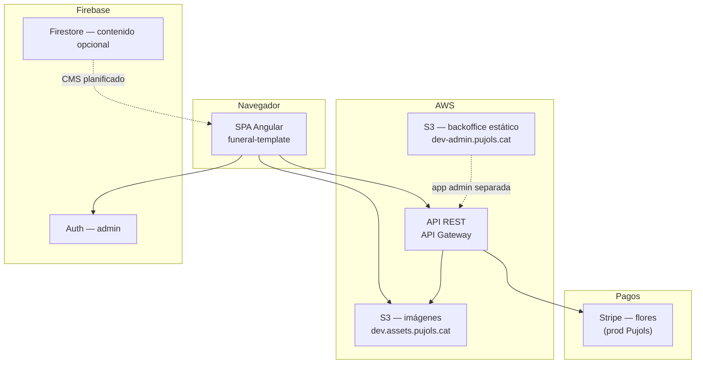

# Proyecto legacy — inventario de características

> **Audiencia:** desarrollo y producto · **Última actualización:** julio 2026  
> **Propósito:** catálogo exhaustivo del sistema antiguo sobre el que se basa el proyecto actual (`funeraria`), para detectar funcionalidad olvidada en la migración.

---

## 1. Qué es el «proyecto antiguo»

No es un único repositorio. El ecosistema legacy consta de **tres capas** que conviene no mezclar:

| Capa | Qué es | Evidencia |
|------|--------|-----------|
| **A. Template Angular** | SPA `funeral-template` (Angular 9) — plantilla reutilizable Eurega Solutions | Reverse-engineering en [`DOCUMENTO_REQUISITOS.md`](./DOCUMENTO_REQUISITOS.md) (RD-001) |
| **B. Extensión backend Pujols** | API y lógica de negocio específica de Funeraria Pujols (campos obituario, condolencias, pagos) | [`pujols/requisits.pdf`](../pujols/requisits.pdf), credenciales en `pujols/funeraria.txt` |
| **C. Despliegue producción Pujols** | Front/back desplegados en AWS (S3, API Gateway) con Stripe en vivo | `pujols/project.txt`, `pujols/funeraria.txt` |

La carpeta [`pujols/`](../pujols/) del repo **no contiene código fuente**: solo notas operativas, imágenes de marca, un PDF de requisitos backend y una foto de referencia de esquela impresa (`2020025.jpg`).

### Leyenda de estado (capa A — código Angular analizado)

| Símbolo | Significado |
|---------|-------------|
| ✅ | Implementado en el repo `funeral-template` |
| ⚠️ | Parcialmente implementado |
| 📋 | Planificado en código/rutas pero vacío o sin UI |
| 🔧 | No está en el Angular; inferido del backend Pujols o despliegue |

---

## 2. Fuentes consultadas

| Fuente | Contenido |
|--------|-----------|
| [`DOCUMENTO_REQUISITOS.md`](./DOCUMENTO_REQUISITOS.md) | DRS completo — reverse-engineering `funeral-template` |
| [`arquitectura.md`](./arquitectura.md) §20 | Comparativa legacy vs nueva arquitectura |
| [`docs/legacy/`](./legacy/) | Requisitos evolucionados (esquela Pujols, flores, CMS…) |
| [`pujols/requisits.pdf`](../pujols/requisits.pdf) | Campos obituario + entidad Condolence (backend) |
| [`pujols/project.txt`](../pujols/project.txt) | URL backoffice dev en S3 |
| [`pujols/funeraria.txt`](../pujols/funeraria.txt) | AWS account, Stripe (producción) |
| [`pujols/issues.txt`](../pujols/issues.txt) | Entorno dev Angular (`node-sass`, `windows-build-tools`) |
| [`public/rescate/README.md`](../public/rescate/README.md) | Assets rescatados del template (`src/assets/images/`) |

**Nota:** El backoffice antiguo (`dev-admin.pujols.cat` en S3) devolvía **404** al verificar en julio 2026. El dominio `pujols.cat` tampoco resolvía a la app.

---

## 3. Arquitectura técnica legacy

### 3.1 Stack frontend (capa A)

| Tecnología | Uso |
|------------|-----|
| Angular 9 | Framework SPA |
| Angular Material | Componentes UI |
| Pug | Plantillas de componentes con variantes (`@Input() template`) |
| ngx-translate | Internacionalización UI |
| RxJS `BehaviorSubject` + `shareReplay` | Estado y caché de esquelas |
| Firebase Auth | Login admin (email + Google OAuth) |
| Librería privada `@eurega/web-core` | Auth, guards, utilidades compartidas Eurega |

### 3.2 Estructura de carpetas (Angular)

```
src/
├── app/
│   ├── core/           # Servicios singleton, guards, interceptors
│   ├── shared/         # Componentes UI, pipes, modelos
│   ├── features/
│   │   ├── public/     # Web pública (home, esquelas, login familiar)
│   │   └── admin/      # Backoffice (vacío)
│   └── app.routes.ts
├── assets/
│   ├── i18n/           # {es, ca, en}.json
│   └── images/         # → rescatados a public/rescate/
├── environments/       # dev, test, prod
└── themes/             # lightTheme, darkTheme
```

### 3.3 Backend e infraestructura (capas B + C)



| Servicio | Responsabilidad |
|----------|-----------------|
| **API REST (AWS)** | CRUD esquelas, iglesias, cementerios, contenido web |
| **S3** | Todas las imágenes (esquelas, CMS, lugares) |
| **Firebase Auth** | Sesiones administrador |
| **Firestore** | Servicio CRUD genérico; **sin uso en UI** |
| **Stripe** | Pasarela de pago flores en producción Pujols 🔧 |
| **Backoffice S3** | Panel admin desplegado aparte del módulo Angular vacío 🔧 |

### 3.4 Variables de entorno (Angular)

| Variable | Uso |
|----------|-----|
| `production` | Modo prod/dev |
| `apiURL` | Base URL API REST |
| `firebase.*` | Configuración Firebase |
| `ImageBucket` | URL base bucket S3 |
| `APP_LOCALSTORAGE_PREFIX` | Prefijo keys `localStorage` |
| `DebugLevel` | Nivel de logging (DEBUG, INFO, ERROR) |

### 3.5 Despliegue

- Build SPA optimizado → carpeta `dist/`
- Hosting con rewrite `** → /index.html` (Firebase Hosting o equivalente)
- Entornos separados: `dev`, `test`, `prod`
- Routing con **hash** en URLs públicas: `/#/page/home`

---

## 4. Actores y roles

| Actor | Descripción | Permisos en legacy |
|-------|-------------|-------------------|
| **Visitante** | Navega la web sin login | Home, esquelas visibles, contacto |
| **Familiar** | Accede con `visitCode` | Ver su esquela (aunque no sea pública), enviar foto, personalizar obituario |
| **Administrador** | Personal de la funeraria | CRUD esquelas, contenido, lugares (objetivo; UI Angular vacía) |
| **Editor** | Rol futuro 📋 | Solo contenido web |
| **Operador** | Rol futuro 📋 | Solo esquelas |

El código Angular incluye **TODOs** para roles `admin` / `editor` / `operator`, sin implementación de permisos granular.

---

## 5. Web pública

### 5.1 Layout común

| Característica | Estado |
|----------------|--------|
| Header fijo al hacer scroll | ✅ |
| Barra superior: teléfono, email, dirección | ✅ |
| Logo + navegación principal | ✅ |
| Botón **«Accés familiars»** → modal `code-form` | ✅ |
| Footer corporativo | ✅ |
| Menú hamburguesa responsive | ✅ |
| Redirect `/` → `/page/home` | ✅ |
| Lazy loading módulos `public` y `admin` | ✅ |

### 5.2 Home — secciones del template Angular (capa A)

La home legacy tenía **6 bloques de contenido** con datos mock. Cada sección admite contenido i18n `{ es, ca, en }`:

| # | Sección | Componente | Campos principales |
|---|---------|------------|-------------------|
| 1 | **Hero** | `bg-image` | `bgImage`, `title`, `subtitle`, `text`, `options.filter` |
| 2 | **Iconos destacados** | `rounded-icons` | Icono Material, `title`, `subtitle` (i18n) |
| 3 | **Tarifas** | `pricing` | `title`, `description`, `strong`, `details[]`, `includes[]` |
| 4 | **Portfolio** | `portfolio` | `image`, `logo`, `title`, `description`, `link`, `order` |
| 5 | **Lista de elementos** | `items-list` | `image` de fondo, `title`, `description` |
| 6 | **Servicios** | `boxes-list` | `image`, `title`, `description`, `rel` |

**Claves i18n asociadas:** `home.SECTION_*` (rounded, portfolio, pricing, list, services).

**Assets rescatados** (en `public/rescate/`):

| Carpeta | Uso en legacy |
|---------|---------------|
| `salas/` | Fotos para portfolio / galería (sala1–4.png) |
| `texturas/` | Fondos: `top_bg.jpg`, `white_bg.jpg`, `texture_background_*.png` |

**Objetivo no cumplido en Angular:** cargar contenido desde API o Firestore en producción (solo mocks).

> **Nota:** El diseño «Serenitas» (7 secciones, `why_us`, CTA triple) documentado en [`requisits-home-plantilla.md`](./legacy/requisits-home-plantilla.md) es el **objetivo del proyecto nuevo**, no el layout del Angular original. La home legacy **no tenía** sección «Esquelas recientes» ni «Por qué elegirnos».

### 5.3 Rutas públicas (Angular)

| Ruta | Auth | Descripción | Estado |
|------|------|-------------|--------|
| `/` | No | Redirect → `/page/home` | ✅ |
| `/page/home` | No | Landing corporativa | ✅ |
| `/page/obituary` | No | Listado esquelas (`isVisible = true`) | ⚠️ componente sin ruta |
| `/page/obituary/:id` | No* | Detalle esquela | ⚠️ componente sin ruta |
| `/page/family` | Código | Zona familiar privada | 📋 propuesta |

\* El detalle podía requerir código si `isVisible = false`.

### 5.4 Páginas que el legacy Angular **no tenía**

Estas aparecen en la evolución Pujols / proyecto nuevo:

| Página | Origen |
|--------|--------|
| `/sales-de-vetlla` | Requisito Pujols — catálogo público de salas de vetlla |
| `/esquelas`, `/esquelas/[slug]` | Rutas nuevas (sustituyen `/page/obituary`) |
| `/acceso`, `/mi-esquela` | Zona familiar con página dedicada (sustituye modal) |
| Mapas Google en detalle esquela | Evolución requisitos |
| Missatges conmemoratius + flores en esquela | Evolución requisitos |

---

## 6. Esquelas y obituarios — dominio

### 6.1 Conceptos (aclarados en 2026)

| | **Esquela** | **Obituario** |
|---|-------------|---------------|
| Qué es | Aviso de defunción formal | Homenaje poético |
| Quién crea el texto | Empleado (backoffice) | Familiar |
| Foto | Sí — retocada por empleado | No (salvo extensiones backend) |
| Ejemplo | «Ha mort a Berga el dia 1 als 71 anys…» | Poema del catálogo + dedicatoria |

### 6.2 Modelo de datos — esquela (`obituary` / API)

#### Campos gestionados por admin

| Campo | Descripción | Estado legacy |
|-------|-------------|---------------|
| `name` | Nombre del difunto | ✅ API |
| `deathNotice` | Texto libre defunción (fallback) | ✅ |
| `funeralDetails` | Texto libre funeral (fallback) | ✅ |
| `wakeDetails` | Texto libre vetlla (fallback) | ✅ |
| `deathPlace`, `deathDay`, `ageAtDeath` | Campos estructurados | 🔧 evolución / backend |
| `funeralDatetime` | Fecha/hora funeral (texto) | 🔧 |
| `churchId` | FK iglesia | ✅ API |
| `cemeteryId` | FK cementerio | ✅ API |
| `wakeRoomId` + `wakeSchedule` | Sala de vetlla + horario | 🔧 evolución Pujols |
| `wakeLocation` | Texto libre sala (fallback legacy) | ✅ texto |
| `mortuaryAddress` | Casa mortuoria | 🔧 |
| `showEpd` | Mostrar «E.P.D.» | 🔧 |
| `imagePath` | Foto retocada y publicada | ✅ |
| `visitCode` | Código acceso familiar | ✅ |
| `slug` | URL pública | ✅ |
| `expedientCode` | Referencia interna funeraria | ✅ |
| `isActive` | Código de visita habilitado | ✅ |
| `isVisible` | Aparece en listado público | ✅ |
| `isReady` | Datos completos | ✅ |

#### Campos gestionados por familiar

| Campo | Descripción | Estado legacy |
|-------|-------------|---------------|
| `customImagePath` | Foto digital enviada (original, no publicada) | 🔧 backend Pujols |
| `familyImageStatus` | `pending` \| `rejected` \| `null` | 🔧 |
| `obituarioPoemTemplateId` | Poema del catálogo | 🔧 |
| `obituarioText` | Texto homenaje personalizado | 🔧 |

#### Extensión backend Pujols (`requisits.pdf`) — campos adicionales

| Campo | Tipo | Descripción |
|-------|------|-------------|
| `poem` | longText, nullable | Texto poético del obituario |
| `poemImage` | imagen única, nullable | Imagen asociada al poema |
| `customImage` | imagen única, nullable | Imagen personalizada del familiar |
| `condolences` | array → tabla `Condolence` | Mensajes de condolencia |

### 6.3 Flujos de foto de esquela

**Regla de negocio:** la foto **nunca** se publica tal como llega; el empleado retoca y sube a `imagePath`.

#### Via A — Familiar envía digitalmente

1. Familiar sube foto → `customImagePath` + `familyImageStatus = pending`
2. La esquela pública sigue mostrando `imagePath` anterior
3. Empleado descarga, retoca externamente, publica en `imagePath`
4. Limpia estado pendiente; si no sirve → `rejected`

#### Via B — Familiar trae foto en papel

1. Empleado escanea/fotografía desde backoffice
2. Retoca y publica directo en `imagePath`
3. No pasa por `customImagePath`

### 6.4 Plantilla visual impresa (Funeraria Pujols)

Referencia: [`pujols/2020025.jpg`](../pujols/2020025.jpg) · [`requisits-esquela-plantilla.md`](./legacy/requisits-esquela-plantilla.md)

Layout de 3 zonas: cabecera (marca + contacto), foto vertical, bloque de textos (nombre, defunción, E.P.D., funeral, vetlla).

### 6.5 Catálogo de poemas (`poem_templates`)

Poemas predefinidos para el **obituario** (no para el texto formal de la esquela). Estado en Angular: ⚠️ parcial.

### 6.6 Página pública de esquela — contenido objetivo

| Bloque | Descripción | Estado legacy |
|--------|-------------|---------------|
| Esquela impresa | Texto + foto + obituario si existe | ⚠️ componente sin integrar en rutas |
| Lugares (iglesia + cementerio) | Enlaces Google Maps | 📋 inferido |
| Missatge conmemoratiu | Formulario visitante → sala de vetlla | 🔧 entidad Condolence |
| Compra de flores | Catálogo + dedicatoria + pago | 🔧 Stripe prod |

---

## 7. Condolencias / missatges conmemoratius (capa B)

Entidad **`Condolence`** definida en `pujols/requisits.pdf` (estilo Symfony/Doctrine):

| Campo | Tipo | Descripción |
|-------|------|-------------|
| `id` | — | Identificador |
| `name` | string(150) | Nombre de quien envía |
| `text` | longText | Texto de la condolencia |
| `checked` | boolean | Admin marca manualmente como «visto/revisado» |
| `obituary_id` | FK | Relación ManyToOne con obituario |

**Flujo familiar documentado en PDF:**

1. Entra a zona de gestión con clave generada
2. Selecciona y/o sube una imagen
3. Selecciona una poesía del catálogo o escribe una
4. Envía payload: `{ poemImage, customImage, poem, obituary_id }`

**Diferencia con evolución 2026:** en el proyecto nuevo la entidad se renombró a `commemorative_messages` y **no incluye** el campo `checked`.

---

## 8. Zona familiar

| Característica | Estado legacy |
|----------------|---------------|
| Acceso mediante `visitCode` | ⚠️ parcial |
| Modal `code-form` desde header | ✅ |
| Validación: esquela no existe → `NO_OBITUARY` | ⚠️ |
| Validación: `isActive = false` → `NOT_ACTIVE` | ⚠️ |
| Ver esquela aunque `isVisible = false` | ✅ diseño |
| Enviar foto (`customImage`) | 🔧 backend |
| Personalizar poema + texto obituario | 🔧 backend |
| **No** puede editar texto formal de esquela | ✅ |
| **No** puede acceder a otras esquelas ni admin | ✅ |
| Persistencia sesión en `localStorage` (opcional) | ✅ servicio |
| Página dedicada `/page/family` o `/mi-esquela` | 📋 / nuevo proyecto |

**Claves i18n:** `core.LOGIN_HEADER_TITLE`, `core.LOGIN_FORM`, `public.dialogs.LOGIN`, `public.dialogs.CLOSE`.

---

## 9. Backoffice administrativo

### 9.1 Estado real en Angular (capa A)

| Módulo | Estado |
|--------|--------|
| `AdminModule` y rutas `/admin/*` | 📋 **vacío** — fallan en runtime |
| Componente `signin` (login admin) | ⚠️ existe, sin pantallas que lo usen |
| Login Google OAuth | ⚠️ componente, sin flujo completo |
| Dashboard | 📋 |
| CRUD esquelas + datatable | 📋 |
| Editor contenido home | 📋 |
| CRUD lugares | 📋 inferido API |

### 9.2 Backoffice desplegado (capa C)

URL documentada: `http://dev-admin.pujols.cat.s3-website-eu-west-1.amazonaws.com`

- App estática en **S3** (probablemente distinta del `AdminModule` Angular vacío)
- Era el panel operativo real de Pujols 🔧
- **Inaccesible** en julio 2026 (404)

### 9.3 Funcionalidad objetivo del backoffice (planificado en DRS)

| Área | Características |
|------|-----------------|
| **Auth** | Email + contraseña (mín. 5 chars), Google OAuth, Firebase Auth |
| **Esquelas** | CRUD, datatable (Nombre, Activo, Visible, Completado), formulario + preview, upload foto, gestión foto familiar pendiente, generar `visitCode`/`slug` |
| **Lugares** | CRUD iglesias y cementerios (nombre, ciudad, Google Maps, foto) |
| **CMS** | Editar secciones home multilingüe, preview, publicar |
| **Condolencias** | Listado con flag `checked` 🔧 |
| **Flores** | Catálogo productos + comandas por difunto 🔧 |
| **Roles** | `admin`, `editor`, `operator` 📋 |

### 9.4 Rutas admin planificadas (Angular)

| Ruta | Descripción |
|------|-------------|
| `/admin` | Dashboard |
| `/admin/obituaries` | CRUD esquelas |
| `/admin/content` | Editor home |
| `/admin/places` | Iglesias y cementerios |

---

## 10. E-commerce de flores (capa B + C)

Requisito evolucionado; en producción Pujols había **Stripe** configurado (claves en `pujols/funeraria.txt` — no reproducir en documentación).

| Característica | Estado legacy |
|----------------|---------------|
| Catálogo productos (corona, ramo, centro…) | 🔧 |
| Checkout desde página de esquela | 🔧 |
| `dedicationText` obligatorio en tarjeta | 🔧 |
| Datos comprador: nombre, email, teléfono | 🔧 |
| Pasarela Stripe | 🔧 prod |
| Estados: `pending_payment` → `paid` → `in_preparation` → `delivered` | 🔧 |
| Admin: CRUD catálogo + listado comandas | 🔧 backoffice S3 |

---

## 11. Catálogo de lugares

### 11.1 En API legacy (inferido)

| Entidad | Campos conocidos |
|---------|------------------|
| `churches` | `name`, `city`, `googleMapsUrl`, `imagePath` |
| `cemeteries` | `name`, `googleMapsUrl`, `imagePath` |

### 11.2 Evolución Pujols (no en Angular original)

| Entidad | Campos adicionales |
|---------|-------------------|
| `wake_rooms` | `name`, `description`, `imagePath`, `address`, geoloc, `isActive` |
| Página `/sales-de-vetlla` | Listado público de salas activas |

---

## 12. Internacionalización (i18n)

| Característica | Estado legacy |
|----------------|---------------|
| Idiomas: **ES, CA, EN** | ✅ |
| Detección idioma navegador; fallback `en` | ✅ |
| UI: `assets/i18n/{lang}.json` | ✅ |
| Contenido negocio: `{ es, ca, en }` por campo | ✅ |
| Selector manual de idioma (header/footer) | 📋 propuesto |

---

## 13. Theming y personalización

| Característica | Estado legacy |
|----------------|---------------|
| Temas `lightTheme` / `darkTheme` | ✅ variables CSS en `:root` |
| Colores: fondo, texto, primario, secundario, error, warning | ✅ |
| Personalización por despliegue/cliente | ✅ env vars (logo, colores, contacto, bucket) |
| Variantes visuales por componente (`@Input template`, `@Input options`) | ✅ |

**Contacto Funeraria Pujols** (valores de referencia):

| Campo | Valor |
|-------|-------|
| Teléfono | 938250119 |
| Dirección | C/. Roser, 22 08680 GIRONELLA |
| Email | funeraria@pujols.cat |

---

## 14. Componentes UI reutilizables (inventario Angular)

| Componente | Responsabilidad |
|------------|-----------------|
| `bg-image` | Hero con imagen de fondo y filtros |
| `rounded-icons` | Grid iconos circulares Material |
| `pricing` | Tarjetas de precios/ofertas |
| `portfolio` | Carrusel/grid portfolio |
| `title-image` | Separador con imagen y títulos |
| `items-list` | Lista con imagen de fondo |
| `boxes-list` | Grid de servicios/cajas |
| `section-header` | Título + subtítulo de sección |
| `obituaries` | Listado y detalle esquelas |
| `header` / `footer` | Layout público |
| `code-form` | Modal acceso familiar por código |
| `signin` | Modal login administrador |

Patrón común: `@Input()` datos, `@Input() template` (variante visual), `@Input() options` (comportamiento: `bgFixed`, `logo`, etc.).

---

## 15. Servicios de dominio (Angular)

| Servicio | Responsabilidad | Estado |
|----------|-----------------|--------|
| `CoreService` | Init: debug, idioma, API URL, tema, prefetch esquelas | ✅ |
| `ObituaryService` | CRUD en caché, filtros, búsqueda por código | ✅ |
| `AuthService` (familiar) | Sesión por código de visita | ⚠️ |
| `AuthService` (admin) | Firebase email/Google | ⚠️ duplicado con `@eurega/web-core` |
| `LocalStorageService` | Persistencia cliente con prefijo | ✅ |
| `FirebaseFirestoreService` | CRUD Firestore genérico | ✅ sin uso UI |
| `ContentFirebaseService` | Contenido dinámico home | 📋 sin implementar |

---

## 16. API REST inferida (AWS)

```
GET    /obituary              → Array<IObituary>
GET    /obituary/:id          → IObituary
POST   /obituary              → Crear (admin)
PUT    /obituary/:id          → Actualizar (admin)
DELETE /obituary/:id          → Eliminar (admin)

CRUD   /churches              → Catálogo iglesias (inferido)
CRUD   /cementeries           → Catálogo cementerios (inferido)
CRUD   /content               → Secciones home CMS (inferido)
```

Imágenes servidas desde bucket S3 (`dev.assets.pujols.cat` en dev).

---

## 17. Casos de uso principales

| ID | Flujo |
|----|-------|
| CU-01 | Visitante accede → detecta idioma → aplica tema → renderiza home |
| CU-02 | Visitante ve listado esquelas (`isVisible = true`) → click → detalle |
| CU-03 | Familiar pulsa «Accés familiars» → introduce código → accede a su esquela |
| CU-04 | Admin crea esquela → sube imagen → asigna iglesia/cementerio → genera código → publica |
| CU-05 | Admin edita textos home en ES/CA/EN → guarda y publica |

---

## 18. Requisitos no funcionales

| Área | Característica |
|------|----------------|
| **Rendimiento** | Lazy modules; caché esquelas `shareReplay`; imágenes vía CDN/S3 |
| **Seguridad** | Códigos no predecibles (server-side); auth dual familiar/admin; guards; claves API no en frontend prod |
| **Compatibilidad** | Responsive móvil/tablet/desktop; Chrome, Firefox, Safari, Edge (últimas 2 versiones) |
| **Accesibilidad** | WCAG AA objetivo v1.1; labels; teclado en modales |
| **Mantenibilidad** | Separación `web/`, `admin/`, `shared/`; interfaces tipadas; logging configurable |
| **Despliegue** | SPA + rewrite; entornos dev/test/prod |

---

## 19. Deuda técnica y riesgos del legacy

| Problema | Impacto |
|----------|---------|
| **Doble `AuthService`** (local vs `@eurega/web-core`) | Guards inconsistentes |
| **`AuthGuard` no registrado** en providers raíz | Rutas protegidas fallan |
| **`AdminModule` vacío** | `/admin` no funcional en Angular |
| **Componente esquelas sin rutas** | Feature a medias |
| **Dependencia `@eurega/web-core`** | Librería privada; difícil de mantener |
| **Claves Firebase en repo** | Riesgo seguridad; rotar y externalizar |
| **`node-sass@4.10.0`** | Entorno dev frágil en Windows (ver `pujols/issues.txt`) |

---

## 20. Resumen ejecutivo — qué había realmente

```
┌─────────────────────────────────────────────────────────────┐
│  ANGULAR funeral-template (capa A)                          │
│  ✅ Home mock (6 secciones)                                 │
│  ✅ Layout, i18n, theming, componentes UI                   │
│  ⚠️ Esquelas (componente sin rutas)                         │
│  ⚠️ Auth familiar parcial                                     │
│  📋 Admin vacío                                              │
├─────────────────────────────────────────────────────────────┤
│  BACKEND + DESPLIEGUE PUJOLS (capas B + C)                  │
│  🔧 API REST esquelas, lugares, contenido                   │
│  🔧 Foto familiar, obituario, poemImage                     │
│  🔧 Condolence con flag checked                             │
│  🔧 Backoffice S3 operativo (ya no accesible)               │
│  🔧 Stripe flores en producción                             │
└─────────────────────────────────────────────────────────────┘
```

El antiguo **no era un producto terminado en frontend**: era un template Angular con web corporativa montada y esquelas a medias, mientras la lógica de negocio real vivía en **backend AWS + backoffice S3** que ya no está disponible para inspección directa.

---

## 21. Relación con el proyecto actual

Este documento inventaría el legacy. Para el **cruce con el proyecto Next.js** (qué se migró, qué se rediseñó a propósito, qué falta), usar:

| Documento | Contenido |
|-----------|-----------|
| [`ROADMAP_ENTREGA.md`](./ROADMAP_ENTREGA.md) | Estado actual por área (81% jul 2026, 74/91 tareas) |
| [`DOCUMENTO_REQUISITOS.md`](./DOCUMENTO_REQUISITOS.md) | Requisitos objetivo del producto nuevo |
| [`arquitectura.md`](./arquitectura.md) §20 | Tabla comparativa legacy vs Next.js + Supabase |
| [`docs/legacy/`](./legacy/) | Especificaciones detalladas por módulo |

### Diferencias arquitectónicas clave (legacy → nuevo)

| Aspecto | Legacy | Nuevo |
|---------|--------|-------|
| Framework | Angular 9 SPA | Next.js 16 App Router |
| Backend | AWS API Gateway | SQLite local → Supabase prod |
| Imágenes | S3 | `./storage/` → Supabase Storage |
| Auth admin | Firebase (doble servicio) | Mock local → Supabase Auth |
| Auth familiar | Código + localStorage | JWT cookie `family_session` |
| Routing | Hash `/#/page/home` | URLs limpias, SSR, i18n rutas |
| Home | 6 secciones (pricing, portfolio…) | 7 secciones mockup Serenitas |
| i18n | ES, CA, EN | CA + ES (next-intl); EN pendiente |
| Admin | Vacío en Angular | Backoffice completo implementado |

---

## 22. Glosario

| Término | Definición |
|---------|------------|
| **Esquela** | Aviso formal de defunción (texto + foto retocada) |
| **Obituario** | Homenaje poético personalizado por el familiar |
| **Condolence** | Entidad legacy de mensaje conmemorativo con flag `checked` |
| **visitCode** | Código alfanumérico de acceso familiar |
| **expedientCode** | Referencia interna de la funeraria |
| **isVisible** | Esquela visible en listado público |
| **isActive** | Código de visita habilitado |
| **isReady** | Datos de esquela completos |
| **ImageBucket** | URL base del almacén S3 de imágenes |
| **funeral-template** | Repositorio Angular 9 origen del reverse-engineering |

---

## 23. Anexo — archivos en `pujols/`

| Archivo | Descripción |
|---------|-------------|
| `project.txt` | URL backoffice dev S3 |
| `funeraria.txt` | Credenciales AWS y Stripe (**sensibles — no commitear**) |
| `issues.txt` | Notas entorno dev Angular en Windows |
| `requisits.pdf` | Spec backend: poem, poemImage, customImage, Condolence |
| `2020025.jpg` | Referencia visual esquela impresa |
| `images/funeraria pujols*.png` | Logos e isotipos de marca |

---

*Documento generado a partir del análisis de `pujols/`, `DOCUMENTO_REQUISITOS.md` y documentación en `docs/legacy/`. Actualizar si aparece código fuente adicional del template Angular o del backend AWS.*
